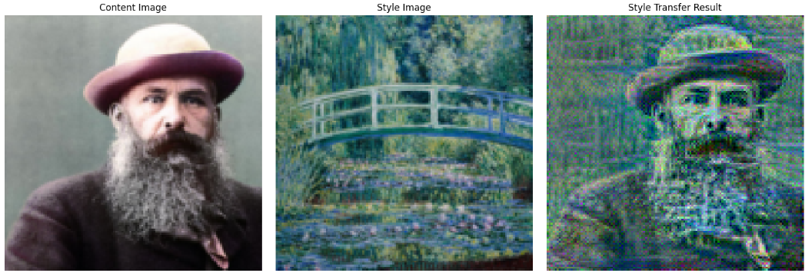
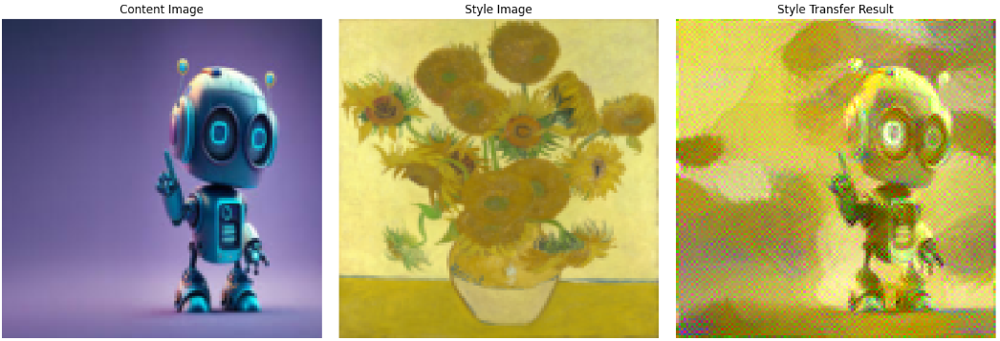

# Neural Style Transfer 

This is a PyTorch implementation of neural style transfer based on the paper [A Neural Algorithm of Artistic Style](https://arxiv.org/pdf/1508.06576) by Gatys et al. 
The aim is to transfer the artistic style of one image onto the content of another using a deep CNN (in this case a pre-trained VGG19 network).

Here is an example of the Taj Mahal mixed with the style The Starry Night by Vincent van Gogh:

Here are a couple more examples:

As you can see it works, but the input quality and style loss can be improved to obtain a cleaner result, which is my immediate focus for now. 

I also plan to optimize this naive implementation according to the paper Perceptual Losses for Real-Time Style Transfer
and Super-Resolution by Johnson et al. and also apply the algorithm to video streams so it can process in real-time (most likely using OpenCV).
